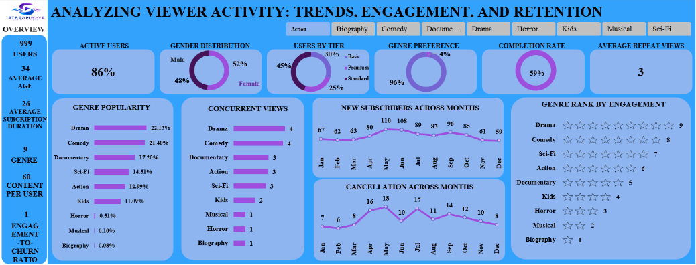

# StreamWave Viewer Engagement Activity Analysis

---

## Project Overview

This project analyzes viewer behavior on StreamWave, a fictional streaming platform, using Microsoft Excel. The objective was to understand user engagement patterns, identify popular content categories, evaluate subscription trends, and provide actionable recommendations to improve viewer retention and platform performance.

Interactive dashboards were developed using Pivot Tables, Pivot Charts, KPIs, and Slicers to transform raw user activity data into meaningful business insights. The final deliverable includes an executive dashboard and presentation designed to support stakeholder decision-making.

---

## Business Problem

StreamWave sought to better understand how users interact with content across its platform. Despite collecting extensive user activity data, the organization lacked visibility into viewer preferences, subscription behavior, and retention patterns.

Management required a data-driven solution to answer key business questions related to:

- User engagement
- Content popularity
- Viewer retention
- Subscription trends
- Completion rates
- Customer churn indicators

---

## Project Objectives

- Analyze viewer engagement patterns.
- Identify the most popular content genres.
- Evaluate subscription tier distribution.
- Measure content completion rates.
- Track subscriber growth trends.
- Assess cancellation patterns.
- Develop an interactive dashboard for stakeholders.

---

## Key Questions

- Which genres are the most popular among viewers?
- What percentage of users actively engage with content?
- How are users distributed across subscription tiers?
- How frequently do users rewatch content?
- How have subscriber numbers changed throughout the year?
- Which months experience the highest cancellation rates?
- What factors may contribute to viewer churn?

---

## Tools & Technologies

- Microsoft Excel
- Pivot Tables
- Pivot Charts
- Slicers
- Excel Formulas
- Dashboard Design
- Data Visualization
- Business Intelligence
- Git & GitHub

---

## Data Preparation

The dataset underwent several preparation steps prior to analysis:

- Cleaned and validated user, subscription, and viewing activity data.
- Created Pivot Tables for KPI calculations.
- Developed calculated metrics and percentage-based insights.
- Built Pivot Charts to visualize trends and patterns.
- Implemented slicers for interactive dashboard filtering.
- Designed an executive dashboard for stakeholder reporting.

---

## Dataset Summary

| Metric | Value |
|------|------:|
| Total Users | 999 |
| Active Users | 86% |
| Average Age | 34 |
| Average Subscription Duration | 26 Months |
| Number of Genres | 9 |
| Average Repeat Views | 3 |
| Completion Rate* | Dynamic by Genre |

> *Completion rates are dynamic and update based on the selected genre using interactive slicers.*

---

## Dashboard Features

### User Overview

- Active Users
- Gender Distribution
- User Tier Distribution

### Content Analytics

- Genre Popularity
- Concurrent Views by Genre
- Genre Engagement Ranking

### Subscription & Retention Analysis

- New Subscribers Across Months
- Cancellation Trends
- Average Repeat Views
- Dynamic Completion Rate Analysis

---

## Dashboard Preview

### Interactive Features

- Genre Slicer
- Dynamic Pivot Charts
- Interactive KPI Cards
- Genre-Based Filtering
- Real-Time Dashboard Updates

---

## Key Findings

- Drama (22.13%) and Comedy (21.40%) were the most popular genres.
- Female users represented 52% of the user base.
- Premium subscribers accounted for the largest subscription segment.
- Completion rates varied significantly across genres, ranging from approximately 54% to 100%.
- Subscriber growth peaked during May and June.
- Cancellation rates increased notably during April and May.
- Users watched content an average of three times, indicating moderate engagement and repeat consumption.

---

## Recommendations

1. Increase investment in Drama and Comedy content due to their strong audience appeal.
2. Investigate the drivers behind elevated cancellation rates during Q2.
3. Implement personalized recommendation systems to improve viewer engagement.
4. Develop retention campaigns targeting subscribers at risk of churning.
5. Increase promotional efforts during periods of declining subscriber growth.
6. Monitor content completion rates to identify opportunities for content optimization.

---

## Business Impact

This analysis provides StreamWave stakeholders with valuable insights into viewer behavior and subscription trends. By leveraging these findings, the organization can:

- Improve customer retention.
- Increase viewer engagement.
- Optimize content investment decisions.
- Enhance subscription performance.
- Support data-driven business strategies.

---

## Key Learnings

Through this project, I strengthened my ability to:

- Build interactive Excel dashboards.
- Create Pivot Tables and Pivot Charts.
- Develop KPI-driven reports.
- Perform customer behavior analysis.
- Design executive-level dashboards.
- Translate business questions into analytical insights.
- Present findings to both technical and non-technical stakeholders.

---

## Skills Demonstrated

- Microsoft Excel
- Pivot Tables
- Pivot Charts
- Dashboard Design
- Data Visualization
- Business Intelligence
- Data Analysis
- Customer Analytics
- Data Storytelling
- Stakeholder Reporting

---

## Repository Contents

| File | Description |
|------|-------------|
| StreamWave_Viewer_Activity_Analysis.xlsx | Main Excel workbook containing the interactive dashboard |
| StreamWave_Executive_Presentation.pdf | Executive presentation summarizing findings and recommendations |
| Dashboard-preview.png | Main dashboard screenshot |
| README.md | Project documentation |

---

## Author

**Sarah Abhulimhen**

---

## Connect With Me

- LinkedIn: https://www.linkedin.com/in/sarah-abhulimhen-7353213ba/
- GitHub Portfolio: https://github.com/Sarah-Abhulimhen
- Email: sarahabhulimhen9@gmail.com

---

© 2026 Sarah Abhulimhen
